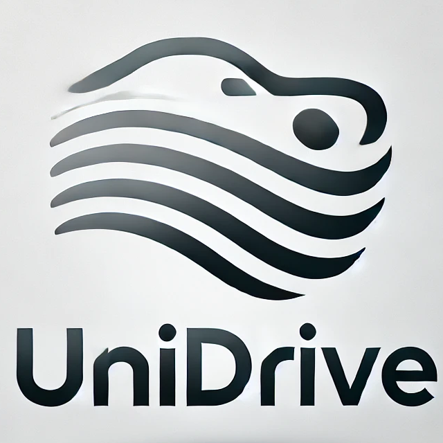
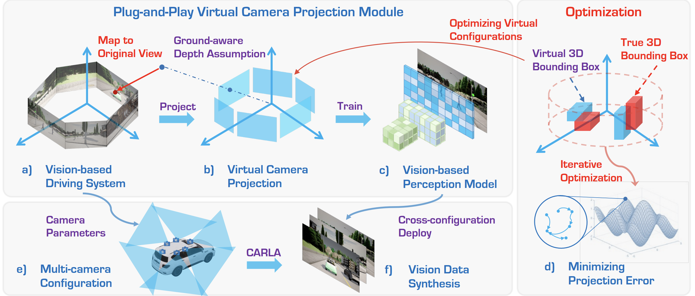
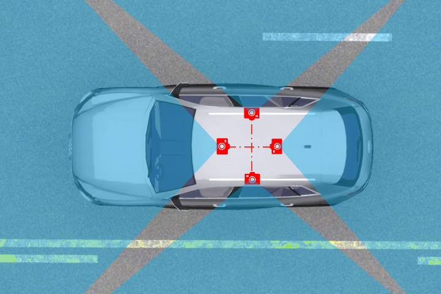
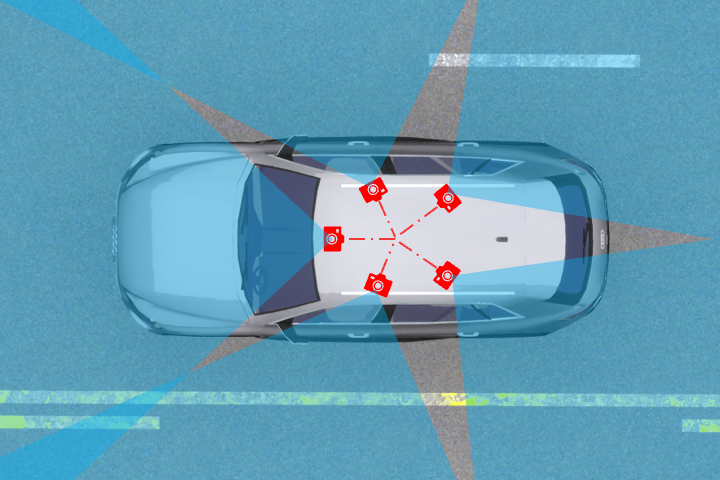
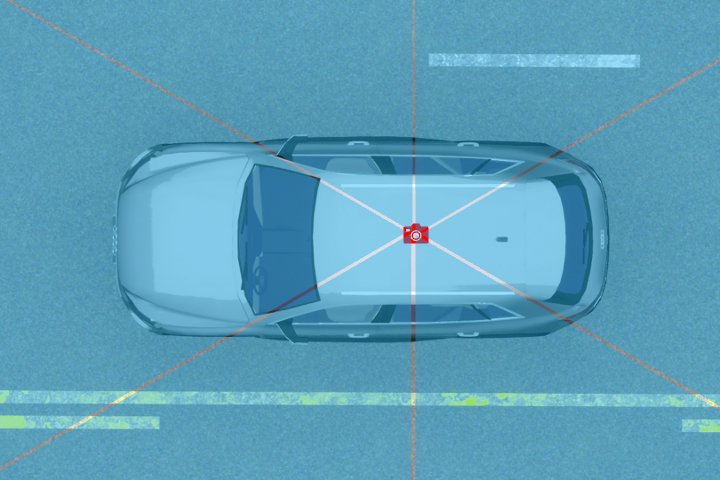
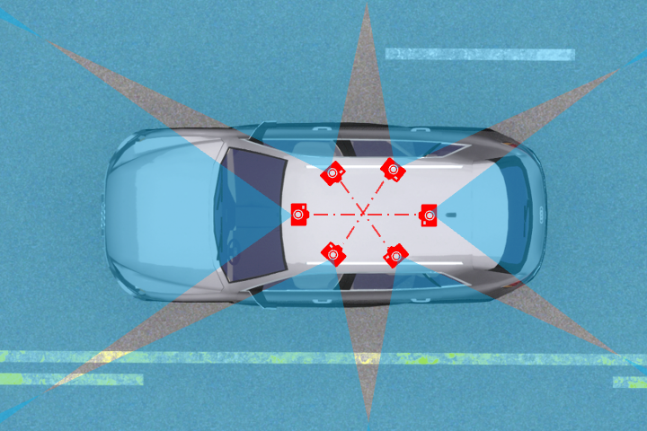
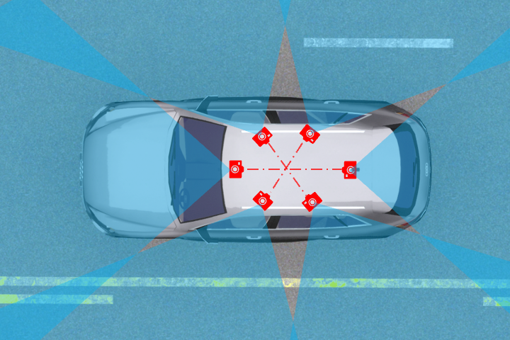
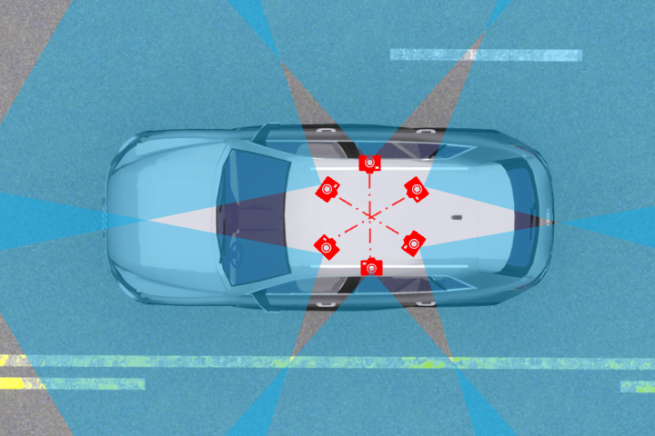
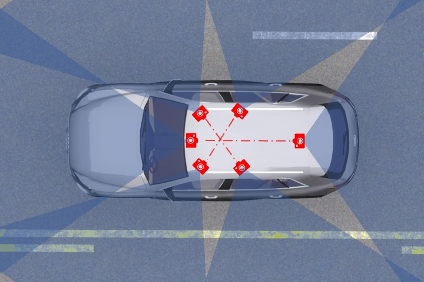
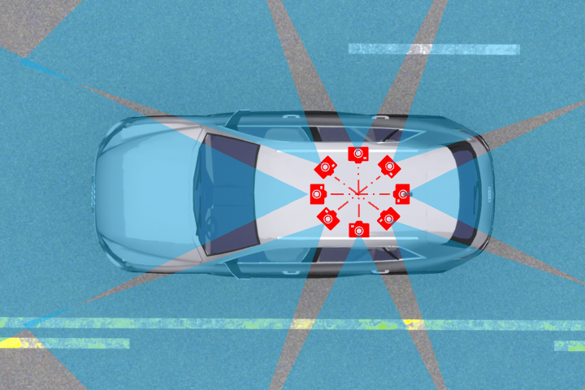

<p align="center">
  
  
  <h3 align="center"><strong>UniDrive: Towards Universal Driving Perception Across Camera Configurations</strong></h3>

  <p align="center">
      <a href="https://ywyeli.github.io/" target='_blank'>Ye Li</a><sup>1</sup>&nbsp;&nbsp;&nbsp;
      <a href="https://wzzheng.net/" target='_blank'>Wenzhao Zheng</a><sup>2</sup>&nbsp;&nbsp;&nbsp;
      <a href="https://robotics.umich.edu/profile/xiaonan-sean-huang/" target='_blank'>Xiaonan Huang</a><sup>1</sup>&nbsp;&nbsp;&nbsp;
      <a href="https://people.eecs.berkeley.edu/~keutzer/" target='_blank'>Kurt Keutzer</a><sup>2</sup>
  <br />
  <sup>1</sup>University of Michigan, Ann Arbor&nbsp;&nbsp;&nbsp;
  <sup>2</sup>University of California, Berkeley&nbsp;&nbsp;&nbsp;
  </p>

</p>

<p align="center">
  <a href="https://arxiv.org/abs/2410.13864" target='_blank'>
    
  </a>
  
  <a href="https://wzzheng.net/UniDrive" target='_blank'>
    
  </a>
  
  <a href="" target='_blank'>
    
  </a>
  
  <a href="" target='_blank'>
    
  </a>
  
  <a href="" target='_blank'>
    
  </a>
</p>


## About

`UniDrive` is a novel framework designed to address the challenge of generalizing perception models across multi-camera configurations.
- To the best of our knowledge, UniDrive presents the first comprehensive framework designed to generalize vision-centric 3D perception models across diverse camera configurations.
- We introduce a novel strategy that transforms images into a unified virtual camera space, enhancing the robustness for camera parameter variations.
- We propose a virtual configuration optimization strategy that minimizes projection error, improving model generalization with minimal performance degradation.
- We contribute a systematic data generation platform along with a 160,000 frames multi-camera dataset, and benchmark evaluating perception models across varying camera configurations.

Visit our [project page](https://wzzheng.net/UniDrive) to explore more examples. :blue_car:


## :hammer_and_wrench: UniDrive Pipeline
|  |
| :-: | 
| We transform the input images into a unified virtual camera space to achieve universal driving perception. To estimate the depth of pixels in the virtual view for projection, we propose a ground-aware depth assumption strategy. To obtain the most effective virtual camera space for multiple real camera configurations, we propose a data-driven optimization strategy to minimize projection error. |


## Updates

- \[2024.10\] - Our [paper](https://arxiv.org/abs/2410.13864) is available on arXiv.


## Outline

- [Installation](#gear-installation)
- [Data Preparation](#hotsprings-data-preparation)
- [Camera Configuration](#blue_car-camera-configuration)
- [Getting Started](#rocket-getting-started)
- [UniDrive Benchmark](#bar_chart-UniDrive-benchmark)
- [TODO List](#memo-todo-list)
- [Citation](#citation)
- [License](#license)
- [Acknowledgements](#acknowledgements)


## :gear: Installation

For details related to installation and environment setups, kindly refer to [INSTALL.md](assets/INSTALL.md).


## :hotsprings: Data Preparation

The `UniDrive` dataset consists of a total of eight Camera Configurations which are inspired by existing self-driving configurations from autonomous vehicle companies.

Each Camera Configuration contains 4 to 8 sensors. For each Camera Configuration, the sub-dataset consists of 20,000 frames of samples, comprising 10,000 samples for training and 10,000 samples for validation.

|  |  |  | 
| :-: | :-: | :-: | :-: | 
| Town 1 | Town 3 | Town 4 | Town 6 |

We choose four maps (Towns 1, 3, 4, and 6) in CARLA v0.9.10 to collect point cloud data and generate ground truth information. For each map, we manually set 6 ego-vehicle routes to cover all roads with no roads overlapped. The frequency of the simulation is set to 20 Hz. 

Our datasets are hosted by [OpenDataLab](https://opendatalab.com/).
><br>
> OpenDataLab is a pioneering open data platform for the large AI model era, making datasets accessible. By using OpenDataLab, researchers can obtain free formatted datasets in various fields.

Kindly refer to [DATA_PREPARE.md](assets/document/DATA_PREPARE.md) for the details to prepare the `UniDrive` dataset.


## :blue_car: Camera Configuration

|  |  |  |  |
| :-: | :-: | :-: | :-: |
| 4x95 | 5x75 | 6x60 | 6x70 |
|  |  |  | 
| 6x80a | 6x80b | 5x70+110 | 8x50 | 


## :rocket: Getting Started

To learn more usage about this codebase, kindly refer to [GET_STARTED.md](assets/GET_STARTED.md).


## :bar_chart: UniDrive Benchmark


## :memo: TODO List
- [ ] Initial release. 🚀
- [ ] Add Camera Configuration benchmarks.
- [ ] Add more 3D perception models.


## Citation
If you find this work helpful for your research, please kindly consider citing our papers:

```bibtex
 @article{li2024unidrive,
            title={UniDrive: Towards Universal Driving Perception Across Camera Configurations},
            author={Li, Ye and Zheng, Wenzhao and Huang, Xiaonan and Keutzer, Kurt},
            journal={arXiv preprint arXiv:2410.13864},
            year={2024}
          }
```


## License

This work is under the <a rel="license" href="">MIT License</a>, while some specific implementations in this codebase might be with other licenses. Kindly refer to [LICENSE.md](assets/LICENSE.md) for a more careful check, if you are using our code for commercial matters.


## Acknowledgements

This work is developed based on the [MMDetection3D](https://github.com/open-mmlab/mmdetection3d) codebase.

> <br>
> MMDetection3D is an open-source toolbox based on PyTorch, towards the next-generation platform for general 3D perception. It is a part of the OpenMMLab project developed by MMLab.

